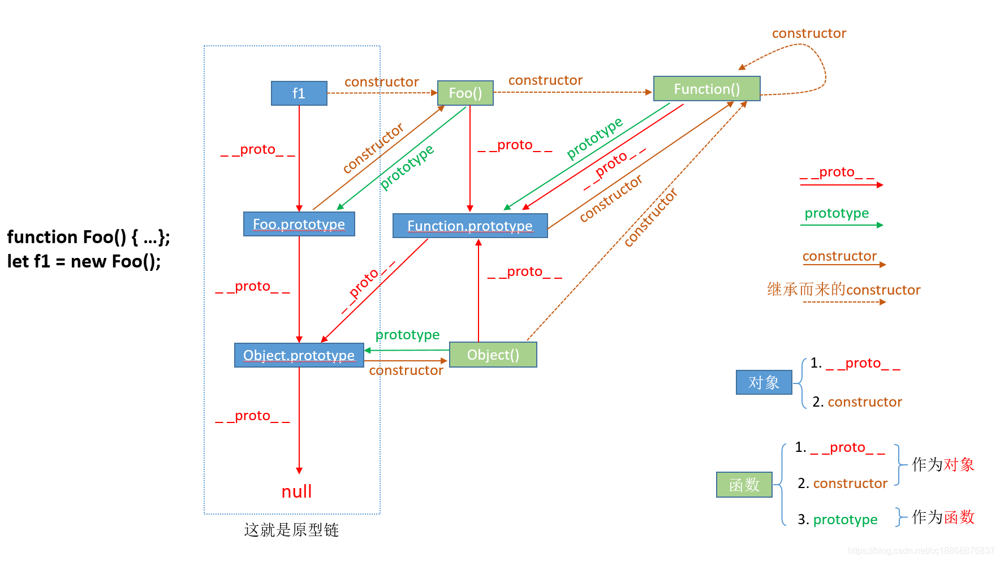

# js汇总

- [js汇总](#js汇总)
    - [什么是二分查找，思路是什么？实现方式有哪些？](#什么是二分查找思路是什么实现方式有哪些)
    - [this 的指向有哪些？](#this-的指向有哪些)
    - [箭头函数](#箭头函数)
    - [new 实现了哪些步骤？(=\>二)](#new-实现了哪些步骤二)
    - [call 和 apply 的定义和区别？(=\>二)](#call-和-apply-的定义和区别二)
    - [call 和 aplly 的简单原生实现](#call-和-aplly-的简单原生实现)
    - [bind 的简单实现](#bind-的简单实现)
    - [检测是否是数组的方法](#检测是否是数组的方法)
    - [原型，原型对象，原型链](#原型原型对象原型链)
    - [constructor/proto/prototype的关系](#constructorprotoprototype的关系)
    - [对继承的理解](#对继承的理解)
    - [es5 的继承](#es5-的继承)
    - [请用一句话描述 try catch 能捕获到哪些 JS 异常](#请用一句话描述-try-catch-能捕获到哪些-js-异常)
    - [js 动画和 css 动画的优缺点](#js-动画和-css-动画的优缺点)
    - [i++与++i 的区别](#i与i-的区别)
    - [闭包](#闭包)
    - [sessionStorage，localStorage，cookie 的区别(=\>九)](#sessionstoragelocalstoragecookie-的区别九)
    - [token、cookie、session 三者的理解](#tokencookiesession-三者的理解)
    - [防抖和节流](#防抖和节流)
    - [浅拷贝和深拷贝](#浅拷贝和深拷贝)
    - [如何实现浅拷贝和深拷贝](#如何实现浅拷贝和深拷贝)
    - [从浏览器地址栏输入 url 到显示页面的步骤](#从浏览器地址栏输入-url-到显示页面的步骤)
    - [浏览器拿到 html 代码后如何解析和渲染页面](#浏览器拿到-html-代码后如何解析和渲染页面)
    - [浏览器渲染原理及流程](#浏览器渲染原理及流程)
    - [字段理解](#字段理解)
    - [三次握手](#三次握手)
      - [简单来说，就是](#简单来说就是)
    - [四次挥手](#四次挥手)
    - [为什么需要三次握手和四次挥手，而不是二次握手，三次挥手](#为什么需要三次握手和四次挥手而不是二次握手三次挥手)
    - [HTTP 状态码以及含义](#http-状态码以及含义)
    - [http 与 https 的区别](#http-与-https-的区别)
    - [http2.0 的新特性](#http20-的新特性)
    - [浏览器缓存](#浏览器缓存)
    - [浏览器行为会引起缓存的变化](#浏览器行为会引起缓存的变化)
    - [request 和 response 返回的 header 有哪些](#request-和-response-返回的-header-有哪些)
    - [content-type](#content-type)
    - [GC 垃圾回收](#gc-垃圾回收)
    - [实现一个函数判断数据类型](#实现一个函数判断数据类型)
    - [图片的懒加载和预加载](#图片的懒加载和预加载)
    - [es5 实现 let](#es5-实现-let)
    - [es5 实现 const](#es5-实现-const)
    - [手写 instanceof](#手写-instanceof)
    - [手写函数柯里化](#手写函数柯里化)
    - [数组实现偏平化](#数组实现偏平化)
    - [promise 的实现](#promise-的实现)
    - [基于Promise实现一个限制并发请求的函数1](#基于promise实现一个限制并发请求的函数1)
    - [基于Promise实现一个限制并发请求的函数2](#基于promise实现一个限制并发请求的函数2)
    - [如何使 a==1 \&\& a==2 \&\& a==3 的值为 true](#如何使-a1--a2--a3-的值为-true)
    - [异步下载 js 的方式](#异步下载-js-的方式)
    - [如何把一个字符串当成js执行（动态执行js）](#如何把一个字符串当成js执行动态执行js)
    - [Event Loop](#event-loop)
    - [内存中的栈和堆](#内存中的栈和堆)
    - [十大排序算法](#十大排序算法)
    - [common.js 和 es6 中模块引入的区别](#commonjs-和-es6-中模块引入的区别)
    - [event.target/event.currentTarget](#eventtargeteventcurrenttarget)
    - [深冻结对象](#深冻结对象)
    - [一道经典面试题](#一道经典面试题)
    - [Async/Await 如何通过同步的方式实现异步？](#asyncawait-如何通过同步的方式实现异步)
    - [promise和async-await的区别](#promise和async-await的区别)
    - [写一个方法，求一个数组长度m,值是n](#写一个方法求一个数组长度m值是n)
    - [es6的新特性](#es6的新特性)
    - [Map与WeakMap的区别](#map与weakmap的区别)
    - [手写ajax](#手写ajax)
    - [最长递增子序列](#最长递增子序列)
    - [preload和prefecth](#preload和prefecth)
    - [将以下class类转成构造函数模式的写法](#将以下class类转成构造函数模式的写法)
    - [面试题](#面试题)
    - [面试题](#面试题-1)
    - [新版本发布后，怎么用技术手段通知用户刷新页面](#新版本发布后怎么用技术手段通知用户刷新页面)
    - [知不知道最新的 url 参数获取的 API](#知不知道最新的-url-参数获取的-api)
    - [proxy和defineProperty的区别](#proxy和defineproperty的区别)

### 什么是二分查找，思路是什么？实现方式有哪些？

- 二分查找：就是在一个已排序的数组中通过值去查找索引。
- 思路：  
   1.将已排序的数组折半，分成两个数组。  
   2.判断要查找的数和中间位置数值的大小，来判断要查找的数实在哪一半  
   3.之后继续折半查找，直至找到这个数。

- 时间复杂度：O(log2n) => O(logn)
- 代码实现：

  1.while 方式

      /**
       *
       * @param {*} arr 已排好的数组
       * @param {*} key 想要查找的值
       */
       function binary_search(arr, key) {
         var low = 0,
           high = arr.length - 1;
         while (low <= high) {
           var mid = parseInt((high + low) / 2);
           if (key == arr[mid]) {
             return mid;
           } else if (key > arr[mid]) {
             low = mid + 1;
           } else if (key < arr[mid]) {
             high = mid - 1;
           } 
         }
       }

  2.递归方式

      /**
      *
      * @param {*} arr 已排好的数组
      * @param {*} low 第一个值的索引
      * @param {*} high 最后一个值的索引
      * @param {*} key 想要查找的值
      */
      function binary_search(arr,low,high,key){
       if (low > high) {
         return -1;
       }
       var mid = parseInt((high + low) / 2);
       if (arr[mid] == key) {
         return mid;
       } else if (arr[mid] > key) {
         high = mid - 1;
         return binary_search(arr, low, high, key);
       } else if (arr[mid] < key) {
         low = mid + 1;
         return binary_search(arr, low, high, key);
       }
      }

### this 的指向有哪些？

1. 函数里的 this：作为普通函数，this 指向 window。
2. 对象的 this：当函数作为对象的方法被调用时，this 就会指向该对象.
3. call，apply 的 this：指向调用该方法的对象
4. 箭头函数的 this：在箭头函数里面，没有 this ，箭头函数里面的 this 是继承外面的环境
5. 构造函数的 this： 指向 new 之后的对象。
6. bind函数可以将根据一个函数生成一个新的函数，并且该函数的this绑定到指定的对象上（新生成的函数绑定了固定的this，再次bind生成的函数不会重新绑定this，很类似箭头函数，不过二者存在很大不同）

    请看下面的例子给出答案

        var boss1 = {
         name: 'boss1',
         returnThis () {
          return this
         }
        }
        var boss2 = {
         name: 'boss2',
         returnThis () {
          return boss1.returnThis()
         }
        }
        var boss3 = {
         name: 'boss3',
         returnThis () {
          var returnThis = boss1.returnThis
          return returnThis()
         }
        }
        boss1.returnThis() // boss1
        boss2.returnThis() // boss1
        boss3.returnThis() // window

        // ----------
        function returnThis () {
         return this
        }
        var boss1 = { name: 'boss1' }
        returnThis() // window
        returnThis.call(boss1) // boss1
        returnThis.apply(boss1) // boss1

        // -------
        function returnThis () {
         return this
        }
        var boss1 = { name: 'boss1'}
        var boss1returnThis = returnThis.bind(boss1)
        boss1returnThis() // boss1
        var boss2 = { name: 'boss2' }
        boss1returnThis.call(boss2) // boss1  通过一个新函数来提供永久的绑定

        // --------
        function showThis () {
         console.log(this)
        }
        showThis() // window
        new showThis() // showThis {}
        var boss1 = { name: 'boss1' }
        showThis.call(boss1) // boss1
        new showThis.call(boss1) // TypeError
        var boss1showThis = showThis.bind(boss1)
        boss1showThis() // boss1
        new boss1showThis() // showThis

        //---------
        function callback (cb) {
         cb()
        }
        callback(() => { console.log(this) }) // window
        var boss1 = {
         name: 'boss1',
         callback: callback,
         callback2 () {
          callback(() => { console.log(this) })
         }
        }
        boss1.callback(() => { console.log(this) }) // window
        boss1.callback2(() => { console.log(this) }) // boss1

        // ------
        var returnThis = () => this
        returnThis() // window
        new returnThis() // TypeError
        var boss1 = {
         name: 'boss1',
         returnThis () {
          var func = () => this
          return func()
         }
        }
        returnThis.call(boss1) // window
        var boss1returnThis = returnThis.bind(boss1)
        boss1returnThis() // window
        boss1.returnThis() // boss1
        var boss2 = {
         name: 'boss2',
         returnThis: boss1.returnThis
        }
        boss2.returnThis() // boss2

### 箭头函数

箭头函数不应用普通函数 this 绑定的四种规则，而是根据外层（函数或全局）的作用域来决定 this，且箭头函数的绑定无法被修改（new 也不行）

- 箭头函数常用于回调函数中，包括事件处理器或定时器
- 箭头函数和 var self = this，都试图取代传统的 this 运行机制，将 this 的绑定拉回到词法作用域
- 特性
  - 没有原型，因为他设计的初衷就是把this的指向拉回当前外层的作用域，继承外部的原型链
  - 没有 super
  - 没有 this
    this 绑定的就是最近一层非箭头函数的 this
  - 没有 arguments,因为它是继承了外部作用域的上下文，可以直接访问外部作用域
    可以通过 rest 参数的形式访问参数
  - 不能通过 new 关键字调用 - 一个函数内部有两个方法：[\[Call]] 和 [\[Construct]]，在通过 new 进行函数调用时，会执行 [\[construct]] 方法，创建一个实例对象，然后再执行这个函数体，将函数的 this 绑定在这个实例对象上
    当直接调用时，执行 [\[Call]] 方法，直接执行函数体 - 箭头函数没有 [\[Construct]] 方法，不能被用作构造函数调用，当使用 new 进行函数调用时会报错。
  - 没有 new.target

### new 实现了哪些步骤？(=>二)

1. 创建一个新对象，
2. 将新创建的对象的原型（proto）指向构造函数的prototype属性。
3. 将构造函数的this指向新创建的对象。
4. 执行构造函数的代码，初始化新对象的属性和方法
5. 如果构造函数返回一个对象，则返回该对象；否则，返回新创建的对象。

源码简单实现：

  ```javascript
  function _new(Fn){
    let obj = {}
    var arg = Array.prototype.slice.call(arguments, 1); // 将类数组转化为数组，调用数组的方法，等价于 下面的写法
    // var arg = Array.prototype.slice.call(argument);arg.shift()
    obj.__proto__ = Fn.prototype; // 将obj的原型链__proto__指向构造函数的原型prototype
    obj.__proto__.constructor = Fn; // 在原型链 __proto__上设置构造函数的构造器constructor，为了实例化Fn
    Fn.apply(obj, arg); // 执行Fn，并将构造函数Fn执行obj
    return obj; // 返回结果
  }
  ```

  ```javascript
  function _new(constructor, ...args){
    let obj = Object.create(constructor.prototype) // 创建一个新的空对象，将其原型指向构造函数的prototype属性
    const res = constructor.apply(obj, args) // 将构造函数的this指向新对象，并执行构造函数
    return res !== null && typeof res === 'object' ? res : obj // 如果构造函数返回一个对象，则返回该对象；否则返回新创建的对象
  }
  ```

### call 和 apply 的定义和区别？(=>二)

    apply：调用一个对象的一个方法，用另一个对象替换当前对象。例如：B.apply(A, arguments);即A对象应用B对象的方法。

    call：调用一个对象的一个方法，用另一个对象替换当前对象。例如：B.call(A, args1,args2);即A对象调用B对象的方法

    从定义中可以看出，call和apply都是调用一个对象的一个方法，用另一个对象替换当前对象。

    而不同之处在于传递的参数，

    apply最多只能有两个参数——新this对象和一个数组arg，如果arg不是数组则会报错TypeError；
    call则可以传递多个参数，第一个参数和apply一样，是用来替换的对象，后边是参数列表。

### call 和 aplly 的简单原生实现

- call 的实现

      Function.prototype.myCall = function(){
       let [thisArg,...args] = [...arguments];
       if(!thisArg){
        thisArg = typeof window === 'undefined'? global : window;
       }
       const fn = Symbol('fn')  // 声明一个独有的Symbol属性, 防止fn覆盖已有属性
       thisArg.fn = this;
       let res = thisArg.fn(...args);
       delete thisArg.fn;
       return res;
      }

      let obj = {
       name:'peter',
       num:2
      }
      function foo(a,b){
       return `${a + b}, ${this.name}, ${this.num}`
      }
      console.log(foo.call(obj,3,4,5)); // 7 peter, 2
      console.log(foo.myCall(obj,3,4,5)); // 7 peter, 2

- apply 的实现

      Function.prototype.myApply = function(context,rest){
       let res;
       if(!context){
        context = typeof window === 'undefined'? global : window;
       }
       const fn = Symbol('fn')
       context.fn = this;
       if(rest){
        res = context.fn(...rest)
       }else{
        res = context.fn()
       }
       delete context.fn;
       return res;
      }

      console.log(foo.apply(obj,[3,4])); // 7, peter, 2
      console.log(foo.myApply(obj,[3,4])) // 7, peter, 2

### bind 的简单实现

    Function.prototype.myBind = function(){
     let [thisArg,...args] = [...arguments];
     let res;
     if(!thisArg){
      thisArg = typeof window === 'undefined'? global : window;
     }
     thisArg.fn = this;
     return function(){
      let all = [...args,...arguments]
      res = thisArg.fn(...all)
      delete thisArg.fn;
      return res
     }
    }
    console.log(foo.myBind(obj,3)(3,4,5))//6, peter, 2
    console.log(foo.bind(obj,3)(3,4,5)) // 6, peter, 2

    Function.prototype.myBind = function(){
     let [thisArg,...args] = [...arguments];
      let self = this;
     if(!thisArg){
      thisArg = typeof window === 'undefined'? global : window;
     }
     return function(){
        return self.apply(thisArg,[...args,...arguments]);
      }
    }
    console.log(foo.myBind(obj,3)(3,4,5))//6, peter, 2
    console.log(foo.bind(obj,3)(3,4,5)) // 6, peter, 2

### 检测是否是数组的方法

let arr = [] // 测试数据

- arr instanceof Array
- arr.constructor === Array
- Object.prototype.toString.call(arr) === ['object Array']
- Array.isArray(arr)
- Array.from(arr)  // 若不是数组，那么返回空数组

### 原型，原型对象，原型链

- 原型
  原型有两种形式：prototype 和**proto**；对应的呈现方式不同。
  　　*prototype：是函数的一个属性，这个属性的值是一个对象。所以一切的函数都有原型，这个原型就是 prototype。
  　　* \_\_proto\_\_：是对象的一个属性，同样的属性值也是一个对象。
- 原型对象
  高程：无论什么时候，只要创建了一个函数，就会根据一组特定的规则为该函数创建一个 prototype 属性，这个属性指向函数的原型对象。在默认情况下，所有的原型对象都会自动获得一个 constructor（构造函数）属性，这个属性包含一个指向 prototype 属性所在函数的指针。
- 原型链
  当试图得到一个对象的某个属性时，如果这个对象本身没有这个属性，那么会去它的**proto**（即它的构造函数的 prototype）中寻找，如果该**proto**上没有这个属性，就去**proto**的属性上去找（\_\_proto\_\_ .\_\_proto\_\_),依次往下找，找到就使用，找不到就继续往下找，到最上层都没有找到就返回 null。这样的就叫原型链。

### constructor/proto/prototype的关系

1. constructor属性是对象拥有的，它是从一个对象指向一个函数，含义就是指向该对象的构造函数
2. proto都是由一个对象指向一个对象，也是对象独有，可以理解为proto指向构造函数的prototype
3. prototype是函数所独有的，它是从一个函数指向一个对象。它的含义是函数的原型对象，也就是这个函数（其实所有函数都可以作为构造函数）所创建的实例的原型对象
可以看图


### 对继承的理解

继承就是对象之间的对属性和方法的一种共享机制，通过创建一个对象，从另一个对象里去继承其方法和属性，在js中，继承基本上是通过原型链实现的

### es5 的继承

- 原型链继承
  采用原型链的形式实现继承

      ```javascript
      function Animal(){
       this.type = 'animal';
      }
      Animal.prototype.feature = function(){
       alert(this.type);
      }
      function Cat(name,color){
       this.name = name;
       this.color = color;
      }
      Cat.prototype = new Animal();

      var tom = new Cat('tom','blue');
      console.log(tom.name);  // 'tom'
      console.log(tom.color); // 'blue'
      console.log(tom.type);  // 'animal'
      tom.feature()    // 'animal'
      ```

  缺点：

  1. 在原型链继承中，包含引用类型值的原型属性会被所有实例共享，如果某一个实例更改了属性或方法，会影响到原型属性，进而影响所有的实例
  2. 没有办法在不影响所有对象实例的情况下，给超类型（Animal）的构造函数传递参数

- 借用构造函数继承
  就是在子类型构造函数的内部使用 apply() 和 call() 方法调用超类型构造函数里的属性或方法。

    ```javascript
    function Animal(name){
      this.name = name;
      this.size = ["large", "small"];
    }
    Animal.prototype.say = function(){
      alert(this.name);
    }
    function Cat(name,age){
      Animal.call(this,name);
      this.age = age;

    }
    var tom = new Cat('tom',18);
    var peter = new Cat('peter',22);
    console.log(tom); // {name: "tom", size: Array[2], age: 18};
    console.log(peter); // {name: "peter", size: Array[2], age: 22};

    tom.size.push('middle');
    console.log(tom.size);  // ["large", "small", "middle"]
    console.log(peter.size); // ["large", "small"]
    tom.say();  // Uncaught TypeError: tom.say is not a function
    ```

  缺点： 1. 由于每个子类型声明自己属性或方法，而且别人不能使用，所以不能复用。 2. 无法调用超类型的原型上的方法。

- 组合继承
  原型链继承实现对原型属性和方法的继承，借用构造函数继承实现对实例属性的继承

    ```javascript
    function Animal(name){
      this.name = name;
      this.size = ["large", "small"];
    }
    Animal.prototype.say = function(){
      alert(this.name);
    }
    function Cat(name,age){
      Animal.call(this,name); // 调用Animal的属性
      this.age = age;
    }
    Cat.prototype = new Animal(name); // 调用Ainaml的原型上的方法。
    Cat.prototype.constructor = Cat;  // 保证Cat的原型上的构造器对象还是指向Cat。
    Cat.prototype.skill = function(){
      alert('running');
    }
    var tom = new Cat('tom',18);
    var peter = new Cat('peter',22);
    console.log(tom); // {name: "tom", size: Array[2], age: 18};
    console.log(peter); // {name: "peter", size: Array[2], age: 22};

    tom.size.push('middle');
    console.log(tom.size);  // ["large", "small", "middle"]
    console.log(peter.size); // ["large", "small"]

    tom.say(); // tom
    peter.say(); // peter
    ```

  缺点
  无论什么情况下都会调用两次超类型构造函数：1 在创建子类型原型的时候，2 在子类型构造函数内部。

- 原型式继承
  此模式就是新对象是利用原要继承的对象挂载到原型上的原理，去使用原型上的属性和方法，然后修改其属性和方法。同样如果不修改属性值，会被所有实例共享。

    ```javascript
    function object(o){
      function F(){};
      F.prototype = o;
      return new F();
    } // 等价于 Oject.create()
    var peter = {
      name:'peter',
      age:18,
      say:function(){
        alert(this.name);
      }
    }
    var tom = object(peter); // var tom = Object.create(peter)
    console.log(tom);  // F {}
    tom.say();  // peter

    tom.name = 'tom';
    tom.age = 22;
    console.log(tom);  // F {name: "tom", age: 22}
    tom.say();  // tom
    ```

- 寄生式继承
  即创建一个仅用于封装继承过程的函数，该函数在内部以某种方式来增强对象，最后返回这个对象。该继承方式最大的特点就是封装成一个函数，在内部扩展对象的属性或方法。

    ```javascript
    function inherit(o){
      var clone = Object.create(o);  // 通过调用函数创建一个对象
      clone.type = 'people';    // 扩展对象属性或方法
      clone.say=function(){
        alert(this.name);
      }
      return clone;
    }
    var peter = {
      name:'peter'
    }
    var perterSon = inherit(peter);
    console.log(perterSon.type);    // people
    perterSon.say();  // peter
    ```

  扩展方法已经写死了，所以不能不复用，进而降低效率。使用情况：在主要考虑对象而不是自定义类型和构造函数的情况下，可以采用寄生式继承。

- 寄生组合式继承
  通过借用构造函数来继承属性，用原型链的混成形式来继承方法。不必为了指定子类型的原型而调用超类型的构造函数。

    ```javascript
    function inheritPrototype(sub,supers){
      var clone = Object.create(supers.prototype);
      clone.constructor = sub;
      sub.prototype = clone;
    }
    ```

  这个函数实现了三个步骤：（先传两个参数，一个子类型构造函数 sub，一个超类型构造函数 super。）

  1. 创建超类型原型的一个副本。
  2. 为创建的副本添加 constructor 属性，从而弥补重写原型而失去的默认的 constructor 属性。
  3. 将新创建的对象（副本）赋值给子类型的原型。

      ```javascript
      function Animal(name){
        this.name = name;
        this.size = ["large", "small"];
      }
      Animal.prototype.say = function(){
        alert(this.name);
      }
      function Cat(name,age){
        Animal.call(this,name);
        this.age = age;
      }
      inheritPrototype(Cat,Animal);
      Cat.prototype.skill = function(){
        alert('running')
      }
      var tom = new Cat('tom',18);
      console.log(tom); // Cat {name: "tom", size: Array(2), age: 18}
      tom.say();   // tom
      tom.skill();  // running
      ```

### 请用一句话描述 try catch 能捕获到哪些 JS 异常

能被 try catch 捕捉到的异常，必须是在报错的时候，线程执行已经进入 try catch 代码块，且处在 try catch 里面，这个时候才能被捕捉到。

### js 动画和 css 动画的优缺点

- js 动画
  - 优点：
    1. js 动画控制能力强，可以在动画播放过程中对动画进行控制，使其开始或停止。
    2. 动画效果比 CSS3 动画丰富，有些动画只有 JS 动画才能实现，比如曲线运动，冲击闪烁等。
    3. 没有兼容性问题
  - 缺点：
    1. js 在浏览器的主线程中运行，而主线程也有其他的 js 脚本，样式布局，绘制任务的存在，会对其造成阻塞，导致丢帧
    2. js 动画的复杂度高于 css 动画
- css 动画
  - 优点：
    1. 浏览器可以对动画进行优化
    2. 对于帧速表现不好的低版本浏览器，CSS3 可以做到自然降级，而 JS 则需要撰写额外代码
  - 缺点：
    1. 运行过程控制较弱,无法附加事件绑定回调函数
    2. 代码冗长。想用 CSS3 实现稍微复杂一点的动画，最后 CSS 代码都会变得特别笨重。
- 结论
  如果只是做简单的状态切换，不需要中间过程控制，可以选择 css 动画。如果要实现功能复杂的动画效果或者组件，推荐使用 js 动画

### i++与++i 的区别

     var i = 1,j = 1;
     var _i = ++i;
     var _j = j++;
     console.log('前置 ','i',i,'_i',_i); // 前置  i 2 _i 2
     console.log('后置 ','j',j,'_j',_j); 后置  j 2 _j 1

### 闭包

- 闭包是指有权访问另一个函数作用域中变量的函数，创建闭包的最常见的方式就是在一个函数内创建另一个函数，通过另一个函数访问这个函数的局部变量,利用闭包可以突破作用链域。
- 闭包的特性：
  1. 函数内再嵌套函数
  2. 内部函数可以引用外层的参数和变量
  3. 参数和变量不会被垃圾回收机制回收
- 闭包的优点：
  1. 可以避免全局变量的污染
  2. 一个是可以读取函数内部的变量，另一个就是让这些变量始终保持在内存中
  3. 实现封装和缓存
- 闭包的缺点：
  1. 使用不当会导致内存泄漏，不用时及时赋值为null；
  2. 消耗内存，浪费性能
- 使用场景：
  1. setTimeout传参
  2. 回调
  3. IIFE
  4. 防抖/节流
  5. 柯里化
  6. 模块化

### sessionStorage，localStorage，cookie 的区别(=>九)

1. cookie，sessionStorage，localStorage 是存放在客户端，session 对象数据是存放在服务器上,session 存储数据更安全一些，一般存放用户信息，浏览器只适合存储一般的数据
2. cookie 数据始终在同源的 http 请求中携带，在浏览器和服务器来回传递,sessionStorage，localStorage 仅在本地保存
3. 大小限制区别，cookie 数据不超过 4kb，localStorage 在谷歌浏览中 2.6MB
4. 数据有效期不同，cookie 在设置的（服务器设置）有效期内有效，不管窗口和浏览器关闭
   sessionStorage 仅在当前浏览器窗口关闭前有效，关闭即销毁（临时存储）
   localStorage 始终有效

### token、cookie、session 三者的理解

1. token 就是令牌，比如你授权(登录)一个程序时,他就是个依据,判断你是否已经授权该软件（最好的身份认证，安全性好，且是唯一的）用户身份的验证方式
2. cookie 是写在客户端一个 txt 文件，里面包括登录信息之类的，这样你下次在登录某个网站，就会自动调用 cookie 自动登录用户名服务器生成，发送到浏览器、浏览器保存，下次请求再次发送给服务器（存放着登录信息）
3. session 是一类用来客户端和服务器之间保存状态的解决方案，会话完成被销毁（代表的就是服务器和客户端的一次会话过程）

### 防抖和节流

- 防抖  
  就是指触发事件后在 n 秒内函数只能执行一次，如果在 n 秒内又触发了事件，则会重新计算函数执行时间。

    ```javascript
    function debounce(func, wait) {
      let timeout;
      return function () {
        if (timeout) clearTimeout(timeout);
        timeout = setTimeout(() => {
          func.apply(this, arguments)
        }, wait);
      }
    }

    // 用debounce来包装scroll的回调
    const better_scroll = debounce(() => console.log('触发了滚动事件'), 1000)
    document.addEventListener('click', better_scroll)
    ```

    适用场景：

    1. 搜索框输入查询
    2. 按钮提交事件
    3. 浏览器窗口缩放，resize事件(如窗口停止改变大小之后重新计算布局)等

- 防抖+立即执行

  ```javascript
  function debouce(fn, wait, isImmediate) {
    let timer = null,
      flag = true;
    if (isImmediate) {
      return function () {
        clearTimeout(timer);
        if (flag) {
          fn.apply(this, arguments);
          flag = false;
        }
        timer = setTimeout(() => {
          flag = true;
        }, wait);
      };
    }
    return function () {
      if (timer) clearTimeout(timer);
      timer = setTimeout(() => {
        fn.apply(this, arguments);
      }, wait);
    };

    /* cancel = function () {
     console.log("立即取消等待");
     clearTimeout(timer);
   } */
  }
  ```

- 节流  
  节流函数的作用是规定一个单位时间，在这个单位时间内最多只能触发一次函数执行，如果这个单位时间内多次触发函数，只能有一次生效。

    ```javascript
    // 时间戳方式
    function throttle(func, wait) {
      let previous = 0;
      return function() {
        let now = Date.now();
        if (now - previous > wait) {
          func.apply(this, arguments);
          previous = now;
        }
      }
    }

    // 定时器方式
    function throttle(func,wait){
      let timer;
      return function(){
        if(!timer){
          timer = setTimeout(()=>{
            func.apply(this,arguments);
            timer = null;
          },wait)
        }
      }
    }

    // 用throttle来包装scroll的回调
    const better_scroll = throttle(() => console.log('触发了滚动事件'), 1000)
    document.addEventListener('scroll', better_scroll)
    ```

    适用场景
    1. 按钮点击事件
    2. 拖拽事件
    3. onscroll
    4. 计算鼠标移动的距离(mousemove)

- throttle+立即执行

  ```javascript
  // 方法1
  function throttle(fn, wait, isImmediate) {
    let timer,
      flag = true;
    if (isImmediate) {
      return function () {
        if (!timer) {
          if (flag) {
            fn.apply(this, arguments);
            flag = false;
          }
          timer = setTimeout(() => {
            flag = true;
            timer = null;
          }, wait);
        }
      };
    }
    return function () {
      if (!timer) {
        timer = setTimeout(() => {
          fn.apply(this, arguments);
          timer = null;
        }, wait);
      }
    };
  }
  // 方法2
  function throttle(fn, wait, isImmediate) {
    var timer;
    return function () {
      if (!timer) {
        isImmediate && fn.apply(this, arguments);
        setTimeout(() => {
          !isImmediate && fn.apply(this, arguments);
          flag = null;
        }, wait);
      }
    };
  }
  ```

- dobounce+throttle
  debounce 的问题在于它“太有耐心了”。试想，如果用户的操作十分频繁——他每次都不等 debounce 设置的 delay 时间结束就进行下一次操作，于是每次 debounce 都为该用户重新生成定时器，回调函数被延迟了不计其数次。频繁的延迟会导致用户迟迟得不到响应，用户同样会产生“这个页面卡死了”的观感。

  为了避免弄巧成拙，我们需要借力 throttle 的思想，打造一个“有底线”的 debounce——等你可以，但我有我的原则：delay 时间内，我可以为你重新生成定时器；但只要 delay 的时间到了，我必须要给用户一个响应。这个 throttle 与 debounce “合体”思路。

  ```javascript
  // fn是我们需要包装的事件回调, delay是时间间隔的阈值
  function throttleDebounce(fn, delay) {
    // last为上一次触发回调的时间, timer是定时器
    let last = 0,
      timer = null;
    // 将throttle处理结果当作函数返回
    return function () {
      // 保留调用时的this上下文
      let context = this;
      // 保留调用时传入的参数
      let args = arguments;
      // 记录本次触发回调的时间
      let now = +new Date();

      // 判断上次触发的时间和本次触发的时间差是否小于时间间隔的阈值
      if (now - last < delay) {
        // 如果时间间隔小于我们设定的时间间隔阈值，则为本次触发操作设立一个新的定时器
        clearTimeout(timer);
        timer = setTimeout(function () {
          last = now;
          fn.apply(context, args);
        }, delay);
      } else {
        // 如果时间间隔超出了我们设定的时间间隔阈值，那就不等了，无论如何要反馈给用户一次响应
        last = now;
        fn.apply(context, args);
      }
    };
  }
  // 用新的throttle包装scroll的回调
  const better_scroll = throttleDebounce(() => console.log("触发了滚动事件"), 1000);
  document.addEventListener("scroll", better_scroll);
  ```

### 浅拷贝和深拷贝

- 浅拷贝是指创建一个对象，这个对象有着原始对象属性值的一份精确拷贝。如果属性是基本类型，那么拷贝的就是基本类型的值，如果属性是引用类型，那么拷贝的就是内存地址，所以如果其中一个对象修改了某些属性，那么另一个对象就会受到影响。
- 深拷贝是指从内存中完整地拷贝一个对象出来，并在堆内存中为其分配一个新的内存区域来存放，并且修改该对象的属性不会影响到原来的对象。

### 如何实现浅拷贝和深拷贝

- 浅拷贝的实现（引用类型）：

  - Object.assign(newObj,oldObj) 方法用于将所有可枚举属性的值从一个或多个源对象复制到目标对象。它将返回目标对象

        let oldObj = {
         name:'peter',
         age:26
        }
        let oldArr = [1,2,3,4,5]
        let newObj = Object.assign({},oldObj)
        let newArr = Object.assign([],oldArr)

  - 通过扩展运算符

        let {...newObj} = oldObj
        let [...newArr] = oldArr

  - 通过数组的 slice 方法(适用与数组)

        let newArr = oldArr.slice()

  - 通过数组的 concat 方法(适用与数组)

        let newArr = oldArr.concat()

- 深拷贝的实现

  - 通过 JSON.stringify()和 JSON.parse()

        let oldObj = {
         name:'peter',
         age:26
        }
        let oldArr = [1,2,3,4,5]
        let newObj = JSON.parse(JSON.stringify(oldObj))
        let newArr = JSON.parse(JSON.stringify(oldArr))

    使用之前考虑的坑：

    - 如果 json 里面有时间对象，则序列化结果：时间对象=>字符串的形式
    - 如果 json 里有 RegExp、Error 对象，则序列化的结果将只得到空对象 RegExp、Error => {}
    - 如果 json 里有 function,undefined,symbol，则序列化的结果会把 function,undefined,symbol 丢失
    - 如果 json 里有 NaN、Infinity 和-Infinity，则序列化的结果会变成 null
    - 如果 json 里有对象是由构造函数生成的，则序列化的结果会丢弃对象的 constructor
    - 如果对象中存在循环引用的情况也无法实现深拷贝（类似于递归嵌套）

  - 原生实现递归拷贝

    - 方法一

      ```javascript
      function deepClone(obj){
        if(obj instanceof RegExp) return new RegExp(obj);
        if(obj instanceof Date) return new Date(obj);
        let objClone = Array.isArray(obj)?[]:{};
        if(obj && typeof obj==="object"){
          for(key in obj){
            if(obj.hasOwnProperty(key)){
            //判断ojb子元素是否为对象，如果是，递归复制
              if(obj[key]&&typeof obj[key] ==="object"){
                objClone[key] = deepClone(obj[key]);
              }else{
                //如果不是，简单复制
                objClone[key] = obj[key];
              }
            }
          }
        }
        return objClone;
      }
      ```

    - 方法二

      ```javascript
      function deepClone(obj,hash = new WeakMap()){
        if(obj instanceof RegExp) return new RegExp(obj);
        if(obj instanceof Date) return new Date(obj);
        if(obj == null || typeof obj !== 'object'){
          return obj;// 如果不是复杂数据类型直接返回obj
        }
        if(hash.has(obj)){
          return hash.get(obj);
        }
        let t = new obj.constructor();
        hash.set(obj,t);
        for(let key in obj){
          if(obj.hasOwnProperty(key)){
            t[key] = deepClone(obj[key],hash)
          }
        }
        return t;
      }
      ```

### 从浏览器地址栏输入 url 到显示页面的步骤

1. 查询 DNS(域名解析),获取域名对应的 IP 地址,
2. 浏览器与服务器建立 tcp 链接（三次握手）
3. 浏览器向服务器发送 http 请求(请求和传输数据）
4. 服务器接受到这个请求后，根据路经参数，经过后端的一些处理生成 html 代码返回给浏览器
5. 浏览器拿到完整的 html 页面代码，解析 HTML 文档，构建 DOM 树，下载资源，构造 CSSOM 树，执行 js 脚本，这些操作没有严格的先后顺序
6. 浏览器根据拿到的资源对页面进行渲染，把一个完整的页面呈现出来

首先浏览器开始解析输入的 URL。它将检查协议（如 HTTP 或 HTTPS）、域名和可能的端口号等组成部分，第一步需要进行 DNS 解析，将域名解析成 ip 地址，如果请求协议是 https，那么还需要建立 SSL/TSL 链接。ip 地址和服务器通过三次握手建立 TCP 通道，浏览器会构建请求体，请求头，以及和该域名相关的 cookie 等数据附加到请求头中，然后向服务器发起构建请求，数据在进入服务端之前，可能会进入到负载均衡的服务器，该作用就是向请求分发到多台服务器上，以便快速响应。之后服务端就返回一些响应信息，包括响应头响应体，其次，浏览器会判断状态码是什么，若是 4 开头的或 5 开头的，就报错，若是 200 则继续进行，若是 301 则重定向，浏览器就开始解析文件，如果是 GZIP 格式，则先解压一下，通过文件的编码格式解码文件。文件解码之后，会开始渲染，将 html 文件构建成 dom 树，在解析dom树中若有 css 文件，则进行css解析，形成 cssom 树，若遇到 js 文件，先判断是否有 async 和 defer，前者是并经下载和执行 js，后者是等到页面渲染完运行 js，如果没有则阻塞渲染等待 js 执行完再继续渲染，再者dom 树和 cssom 树合并成 render 树，进行布局计算，让每个节点都存在于相应的位置，然后浏览器就会根据节点等进行渲染，浏览器使用图形设备接口（例如GPU）来加速绘制操作，最后显示在页面上。

### 浏览器拿到 html 代码后如何解析和渲染页面

1. 解析html，构建dom树，自上而下，自左向右的顺序解析html元素，并将他们转为dom节点，形成依赖关系的树状层次树
2. 构建render树，在解析html中，会解析css，生成cssom树，两者相结合，形成render树，并计算几何信息，盒模型的尺寸位置
3. 布局layout，浏览器进行布局计算，确定每个节点的准确位置和大小
4. 绘制painting，根据布局计算的结果，将页面绘制在屏幕上
5. 合成，绘制完成后，浏览器会将绘制结果合成为一张或多张页面表面（Layer），可以减少页面的重绘和重排次数，并提高渲染性能。

### 浏览器渲染原理及流程

  1. 浏览器获取html文档解析成dom树。
  2. 处理CSS标记，构成层叠样式表模型CSSOM(CSS Object Model)。
  3. 将DOM和CSSOM合并为渲染树(rendering tree)将会被创建，代表一系列将被渲染的对象。
  4. 渲染树的每个元素包含的内容都是计算过的，它被称之为布局layout。浏览器使用一种流式处理的方法，只需要一次绘制操作就可以布局所有的元素。
  5. 将渲染树的各个节点绘制到屏幕上，这一步被称为绘制painting。

- ps:这些过程没有顺序之分，比如DOM或CSSOM被修改时，亦或是哪个过程会重复执行，这样才能计算出哪些像素需要在屏幕上进行重新渲染。而在实际情况中，JavaScript和CSS的某些操作往往会多次修改DOM或者CSSOM。
- ps: DOMContentLoaded和Load的区别
  - DOMContentLoaded事件触发时，仅当DOM加载完成，不包括样式表，图片等，简称页面内容加载完成
  - load事件触发时，页面上所有的DOM，样式表，脚本，图片都已加载完成，简称页面资源加载完成

- 参考文献：（<https://www.jianshu.com/p/e6252dc9be32）>

### 字段理解

- 序列号 seq：占 4 个字节，用来标记数据段的顺序，TCP 把连接中发送的所有数据字节都编上一个序号，第一个字节的编号由本地随机产生；给字节编上序号后，就给每一个报文段指派一个序号；序列号 seq 就是这个报文段中的第一个字节的数据编号。

- 确认号 ack：占 4 个字节，期待收到对方下一个报文段的第一个数据字节的序号；序列号表示报文段携带数据的第一个字节的编号；而确认号指的是期望接收到下一个字节的编号；因此当前报文段最后一个字节的编号+1 即为确认号。

- 确认 ACK：占 1 位，仅当 ACK=1 时，确认号字段才有效。ACK=0 时，确认号无效

- 同步 SYN：连接建立时用于同步序号。当 SYN=1，ACK=0 时表示：这是一个连接请求报文段。若同意连接，则在响应报文段中使得 SYN=1，ACK=1。因此，SYN=1 表示这是一个连接请求，或连接接受报文。SYN 这个标志位只有在 TCP 建产连接时才会被置 1，握手完成后 SYN 标志位被置 0。

- 终止 FIN：用来释放一个连接。FIN=1 表示：此报文段的发送方的数据已经发送完毕，并要求释放运输连接

- PS：ACK、SYN 和 FIN 这些大写的单词表示标志位，其值要么是 1，要么是 0；ack、seq 小写的单词表示序号。

### 三次握手

(转载与<http://blog.itpub.net/31442725/viewspace-2645992/)>


1. 第一次握手：Client 将标志位 SYN 置为 1，随机产生一个值 seq=J，并将该数据包发送给 Server，Client 进入 SYN_SENT 状态，等待 Server 确认。

2. 第二次握手： Server 收到数据包后由标志位 SYN=1 知道 Client 请求建立连接， Server 将标志位 SYN 和 ACK 都置为 1 ， ack=J+1 ，随机产生一个值 seq=K ，并将该数据包发送给 Client 以确认连接请求， Server 进入 SYN_RCVD 状态。

3. 第三次握手： Client 收到确认后，检查 ack 是否为 J+1 ， ACK 是否为 1 ，如果正确则将标志位 ACK 置为 1 ， ack=K+1 ，并将该数据包发送给 Server ， Server 检查 ack 是否为 K+1 ， ACK 是否为 1 ，如果正确则连接建立成功， Client 和 Server 进入 ESTABLISHED 状态，完成三次握手，随后 Client 与 Server 之间可以开始传输数据了。

#### 简单来说，就是

- 建立连接时，客户端发送 SYN 包（SYN=i）到服务器，并进入到 SYN-SEND 状态，等待服务器确认。

- 服务器收到 SYN 包，必须确认客户的 SYN （ ack=i+1 ） , 同时自己也发送一个 SYN 包（ SYN=k ） , 即 SYN+ACK 包，此时服务器进入 SYN-RECV 状态。

- 客户端收到服务器的 SYN+ACK 包，向服务器发送确认报 ACK （ ack=k+1 ） , 此包发送完毕，客户端和服务器进入 ESTABLISHED 状态，完成三次握手，客户端与服务器开始传送数据。

### 四次挥手

(转载与<http://blog.itpub.net/31442725/viewspace-2645992/)>  


1. 第一次挥手：Client 发送一个 FIN，用来关闭 Client 到 Server 的数据传送，Client 进入 FIN_WAIT_1 状态。

2. 第二次挥手： Server 收到 FIN 后，发送一个 ACK 给 Client ，确认序号为收到序号 +1 （与 SYN 相同，一个 FIN 占用一个序号）， Server 进入 CLOSE_WAIT 状态。

3. 第三次挥手： Server 发送一个 FIN ，用来关闭 Server 到 Client 的数据传送， Server 进入 LAST_ACK 状态。

4. 第四次挥手： Client 收到 FIN 后， Client 进入 TIME_WAIT 状态，接着发送一个 ACK 给 Server ，确认序号为收到序号 +1 ， Server 进入 CLOSED 状态，完成四次挥手。

### 为什么需要三次握手和四次挥手，而不是二次握手，三次挥手

由于全双工链接，三次握手保证了双方的发送和接受能力，四次挥手是因为客户端发送资源完成给服务端之后，服务端必须返回ack确认，但是服务端关闭资源需要处理时间，所以再次发送关闭。

### HTTP 状态码以及含义

1. 1xx 信息状态码
   - 100 Continue 继续，一般在发送 post 请求时，已发送了 http header 之后服务端将返回此信息，表示确认，之后发送具体参数信息
2. 2xx 成功状态码

    - 200 OK 正常返回信息
    - 201 Created 请求成功并且服务器创建了新的资源
    - 202 Accepted 服务器已接受请求，但尚未处理

3. 3xx 重定向
   - 301 Moved Permanently 请求的网页已永久移动到新位置。
   - 302 Found 临时性重定向
   - 303 See Other 临时性重定向，且总是使用 GET 请求新的 URI
   - 304 Not Modified 自从上次请求后，请求的网页未修改过。
   - 307 的定义实际上和 302 是一致的，唯一的区别在于，307 状态码不允许浏览器将原本为 POST 的请求重定向到 GET 请求上。
   - 308 的定义实际上和 301 是一致的，唯一的区别在于，308 状态码不允许浏览器将原本为 POST 的请求重定向到 GET 请求上。

4. 4xx 客户端错误
   - 400 Bad Request 服务器无法理解请求的格式，客户端不应当尝试再次使用相同的内容发起请求。
   - 401 Unauthorized 请求未授权
   - 403 Forbidden 禁止访问
   - 404 Not Found 找不到如何与 URI 相匹配的资源
5. 5xx 服务端错误
   - 500 Internal Server Error 服务器遇到了意料不到的情况，不能完成客户的请求。
   - 503 Service Unavailable 服务器端暂时无法处理请求（可能是过载或维护）

### http 与 https 的区别

- http
  - 超文本传输协议
- https
  - 在 http 下加上 ssl 层。
  - 过程
    1. 建立 https 通道
    2. 服务端传递一个证书，所谓一个公钥
    3. 客户端解析证书，生成随机数+证书（密钥），
    4. 传送加密信息，用证书加密后的随机值，目的就是让服务端得到这个随机值，以后客户端和服务端的通信就可以通过这个随机值来进行加密解密了
    5. 服务端解密
    6. 传输加密后的信息
    7. 客户端解密
- 区别
  - HTTPS 更安全：HTTPS 协议是由 SSL+HTTP 协议构建的可进行加密传输、身份认证的网络协议，要比 HTTP 协议的信息明文传输安全；
  - HTTPS 需要申请证书：HTTPS 协议需要到 CA 申请证书，一般免费证书很少。而常见的 HTTP 协议则没有这一项；
  - 端口不同：HTTP 使用的是大家最常见的 80 端口，而 HTTPS 连接使用的是 443 端口；
  - 安全性不同：HTTP 的连接很简单，是无状态的。而 HTTPS 协议是 SSL+HTTP 协议构建的可进行加密传输、身份认证的网络协议，要比 HTTP 协议安全；

### http2.0 的新特性

- 多路复用
- 首部压缩
- 二进制分帧
- 服务端推送

### 浏览器缓存

- 强制缓存： 缓存在未过有效期时，不需要请求资源
  - expires &nbsp;&nbsp;&nbsp; http1.0
    1. 该字段表示缓存到期时间，即有效时间+当时服务器的时间，然后将这个时间设置在 header 中返回给服务器。因此，该时间是一个绝对时间.
    2. 缺点：由于是绝对时间，用户可能会将客户端本地的时间进行修改，而导致浏览器判断缓存失效，重新请求该资源，同时，还导致客户端与服务端的时间不一致，致使缓存失效。
  - cache-control&nbsp;&nbsp;&nbsp; http1.1
    1. 该字段表示资源缓存的最大有效时间，在该时间内，客户端不需要向服务器发送请求，因此是个相对时间。
    2. Cache-Control 的字段可以带的值：
       - no-store：浏览器不要缓存该响应以及该响应对应的页面或资源
       - max-age：即最大有效时间（max-age=222200）
       - no-cache：表示没有缓存，即告诉浏览器该资源并没有设置缓存
       - s-maxage：同 max-age，但是仅用于共享缓存，如 CDN 缓存
       - public：多用户共享缓存，默认设置
       - private：不能够多用户共享，HTTP 认证之后，字段会自动转换成 private
- 对比缓存：先从缓存中获取对应的数据标识，然后向服务器发送请求，确认数据是否更新，如果更新，则返回新数据和新缓存；反之，则返回 304 状态码，告知客户端缓存未更新，可继续使用。
  - Last-Modified --- If-Modified-Since
    1. Last-Modified 是 服务器告知客户端，资源最后一次被修改的时间
    2. If-Modified-Since：再次请求时，请求头中带有该字段，服务器会将 If-Modified-Since 的值与 Last-Modified 字段进行对比，如果相等，则表示未修改，响应 304；反之，则表示修改了，响应 200 状态码，返回数据。
    3. 缺点：
    - 如果资源更新的速度是秒以下单位，那么该缓存是不能被使用的，因为它的时间单位最低是秒。
    - 如果文件是通过服务器动态生成的，那么该方法的更新时间永远是生成的时间，尽管文件可能没有变化，所以起不到缓存的作用。
  - Etag --- If-None-Match
    1. Etag 存储的是文件的特殊标识(一般都是 hash 生成的)，服务器存储着文件的 Etag 字段，可以在与每次客户端传送 If-no-match 的字段进行比较，如果相等，则表示未修改，响应 304；反之，则表示已修改，响应 200 状态码，返回数据。

### 浏览器行为会引起缓存的变化

1. 刷新网页 => 如果缓存没有失效，浏览器会直接使用缓存；反之，则向服务器请求数据
2. 手动刷新（F5） => 浏览器会认为缓存失效，在请求服务器时加上 Cache-Control: max-age=0 字段，然后询问服务器数据是否更新。
3. 强制刷新（Ctrl + F5） => 浏览器会直接忽略缓存，在请求服务器时加上 Cache-Control: no-cache 字段，然后重新向服务器拉取文件。

### request 和 response 返回的 header 有哪些

- 请求(客户端->服务端\[request])
  1. Accept: */*(客户端能接收的资源类型)
  2. Accept-Language: en-us(客户端接收的语言类型)
  3. Connection: Keep-Alive(维护客户端和服务端的连接关系)
  4. Host: localhost:8080(连接的目标主机和端口号)
  5. Referer: <http://localhost/links.asp(告诉服务器我来自于哪里)>
  6. User-Agent: Mozilla/4.0(客户端版本号的名字)
  7. Accept-Encoding: gzip, deflate(客户端能接收的压缩数据的类型)
  8. If-Modified-Since: Tue, 11 Jul 2000 18:23:51 GMT(缓存时间)
  9. Cookie(客户端暂存服务端的信息) xxxxx
- 响应(服务端->客户端\[response])
  1. HTTP/1.1(响应采用的协议和版本号) 200(状态码) OK(描述信息)
  2. Location:<http://www.baidu.com(服务端需要客户端访问的页面路径)>
  3. Server:apache tomcat(服务端的 Web 服务端名)
  4. Content-Encoding:gzip(服务端能够发送压缩编码类型)
  5. Content-Length: 80(服务端发送的压缩数据的长度)
  6. Content-Language: zh-cn(服务端发送的语言类型)
  7. Content-Type:text/html; charset=GB2312(服务端发送的类型及采用的编码方式)
  8. Last-Modified:Tue, 11 Jul 2000 18:23:51 GMT(服务端对该资源最后修改的时间)
  9. Refresh: 1;url=<http://www.it315.org(服务端要求客户端1秒钟后，刷新，然后访问指定的页面路径)>
  10. Content-Disposition: attachment;filename=aaa.zip(服务端要求客户端以下载文件的方式打开该文件)
  11. Transfer-Encoding:chunked(分块传递数据到客户端）
  12. Set-Cookie:SS=Q0=5Lb_nQ; path=/search(服务端发送到客户端的暂存数据)
  13. Expires: -1//3 种(服务端禁止客户端缓存页面数据)
  14. Cache-Control:no-\*\*\*(服务端禁止客户端缓存页面数据)
  15. Pragma: no-\*\*\*(服务端禁止客户端缓存页面数据)
  16. Connection: close(1.0)/(1.1)Keep-Alive(维护客户端和服务端的连接关系)
  17. Date: Tue, 11 Jul 2000 18:23:51 GMT(服务端响应客户端的时间)
      在服务器响应客户端的时候，带上 Access-Control-Allow-Origin 头信息，解决跨域的一种方法。

### content-type

- 前端提交数据方式
  - application/xxx-form-urlencoded
  - mulitpart/form-data
  - application/json
  - application/xml
- response 返回的格式
  - text/plain 纯文本
  - text/html
  - text/xml
  - image/gif
  - image/jpeg
  - image/png
  - application/json
  - ……

### GC 垃圾回收

JS 的垃圾回收机制是为了以防内存泄漏，内存泄漏的含义就是当已经不需要某块内存时这块内存还存在着，垃圾回收机制就是间歇的不定期的寻找到不再使用的变量，并释放掉它们所指向的内存。

- 标记清除法
- 引用计数法

### 实现一个函数判断数据类型

  ```javascript
  function getType(obj) {
     if (obj === null) return String(obj);
     return typeof obj === 'object'
     ? Object.prototype.toString.call(obj).replace('[object ', '').replace(']', '').toLowerCase()
     : typeof obj;
  }
  ```

### 图片的懒加载和预加载

- 预下载

  1. 利用缓存的形式

          function loadImage(url, callback) {
           var img = new Image(); //创建一个Image对象，实现图片的预下载
           img.onload = function () { //图片下载完毕时将img.onload设为null，并异步调用callback函数。
            img.onload = null;
            callback(img);
           };
           img.src = url;
          }

  2. css 方式

          function preloader() {
            if (document.getElementById) {
            document.getElementById("preload-01").style.background = "url(http://domain.tld/image-01.png) no-repeat -9999px -9999px";
            document.getElementById("preload-02").style.background = "url(http://domain.tld/image-02.png) no-repeat -9999px -9999px";
            document.getElementById("preload-03").style.background = "url(http://domain.tld/image-03.png) no-repeat -9999px -9999px";
            }
          }
          function addLoadEvent(func) {
            var oldonload = window.onload;
            if (typeof window.onload != 'function') {
            window.onload = func;
            } else {
            window.onload = function() {
              if (oldonload) {
              oldonload();
              }
              func();
            }
            }
          }
          addLoadEvent(preloader);

- 懒下载
  将页面里所有 img 属性 src 属性用 data-xx 代替，当页面滚动直至此图片出现在可视区域时，用 js 取到该图片的 data-xx 的值赋给 src。

### es5 实现 let

  ```javascript
  function _let(count){
      (function(){
        for(var i = 0; i < count; i ++){
        console.log(i) // 0,1,2,3,4
        }
      })();
      console.log(i) // ReferenceError: i is not defined
      }
      _let(5)
  ```

### es5 实现 const

  ```javascript
  var _const = function(data,value){
    var _window = typeof window === 'undefined'? global : window; // 判断当前的环境
    _window[data] = value; // 把要定义的data挂载到_window下，并赋值value
    Object.defineProperty(_window,data,{
    enumerable:false,
    configurable:false,
    get:function(){
      return value
    },
    set:function(val){
      if(val != value){
      throw new TypeError('Assignment to constant variable')
      }else{
      return value
      }
    }
    })
  }
  _const('a', 10)
  console.log(a)
  a = 20
  ```

### 手写 instanceof

  ```typescript
  function _instanceOf(left,right){
    let proto = left.__proto;
    let prototype = right.prototype;
    while(true){
      if(proto == null){
      return false;
      }else if (proto === prototype){
      return true
      }
      proto = proto.__proto__;
    }
    }

    function _instanceof(left, right) {
    // let _proto = left.__proto__; // 不是官方认同的
    let _proto = Object.getPrototypeOf(left)
    let prototype = right.prototype;

    if (_proto === null) {
      return false;
    } else {
      if (_proto === prototype) {
        return true;
      }
      return _instanceof(_proto, prototype); // 递归调用，并返回结果
    }
  }
  ```

### 手写函数柯里化

  ```javascript
  const curry = fn=>{
    if (typeof fn !== "function") {
      throw Error("No function provided");
    }
    return function curriedFn(...args) {
      if (args.length < fn.length) {
      return function() {
        // let all = [...args,...arguments]
        return curriedFn.apply(null, args.concat([].slice.call(arguments)));
      };
      }
      return fn.apply(null, args);
    };
    }
  ```

### 数组实现偏平化

- ES6 的 flat()

  ```javascript
  let arr = [1,2,3,[4,5,6,[7,8,9]]]
  let res = arr.flat(Infinity)
  console.log(res) // [1,2,3,4,5,6,7,8,9]
  ```

- 序列化+正则

  ```javascript
  let arr = [1,2,3,[4,5,6,[7,8,9]]]
  let res = `[${JSON.stringify(arr).replace(/(\[|\])/g,'')}]`
  console.log(res) // [1,2,3,4,5,6,7,8,9]
  ```

- 递归

  ```javascript
  let arr = [1,2,3,[4,5,6,[7,8,9]]]
  function flat(arr){
    let res = [];
    for(const item of arr){
    item instanceof Array ? res = res.concat(flat(item)):res.push(item)
    }
    return res
  }
  console.log(flat(arr)) // [1,2,3,4,5,6,7,8,9]
  ```

- reduce 式递归

  ```javascript
  let arr = [1,2,3,[4,5,6,[7,8,9]]]
  function flat(arr){
    return arr.reduce((prev, cur)=>{
      return prev.concat(cur instanceof Array?flat(cur):cur)
    },[])
  }
  console.log(flat(arr)) // [1,2,3,4,5,6,7,8,9]
  ```

- 迭代+展开运算符

  ```javascript
  let arr = [1,2,3,[4,5,6,[7,8,9]]]
  while (arr.some(Array.isArray)) {
    arr = [].concat(...arr);
  }
  console.log(arr) // [1,2,3,4,5,6,7,8,9]
  ```

### promise 的实现

```javascript
let PENDING = 'pending';
let FULLFILLED = 'fullfilled';
let REJECTED = 'rejected';

const isFunction = function(fun) {
  return typeof fun === "function";
};
const isObject = function(value) {
  return value && typeof value === "object";
};

class Promise {
  constructor(excutor){
    if(!this || this.constructor !== Promise){
      throw new TypeError("Promise must be called new ")
    }
    if(!isFunction(excutor)){
      throw new TypeError("Promise constructor's argument must be a function")
    }

    this.onFulfilledCallbacks = [];
    this.onRejectedCallbacks = [];
    this.value = null;
    this.status = PENDING;

    let resolve = (value) => {
      resolutionProduce(this,value)
    }
    let resolutionProduce = function(promise, x)  {
      if(x === promise){
        return reject(new TypeError("Promise can not resolved with it seft"));
      }
      if (isObject(x) || isFunction(x)) {
        let called = false;
        try{
          let then = x.then;
          if(isFunction(then)){
            then.call(x, y=>{
              if(called) return;
              called = true;
              resolutionProduce(promise, y);
            }, err=>{
              if(called) return;
              called = true;
              reject(err);
            })
          }
        }
        catch(err){
          if(called) return;
          called = true;
          reject(err);
        }
      }
    }
    let reject = (value) => {
      if(this.status !== PENDING) return 
      this.status = REJECTED;
      this.value = value;
      this.onRejectedCallbacks.forEach(callback=>{
        callback();
      })
    }

    try{
      excutor(resolve, reject);
    }catch(err){
      reject(err);
    }
  }

  then(onFulfilled, onRejected){
    onFullfilled = isFunction(onFullfilled) ? onFullfilled : value => value;
    onRejected = isFunction(onRejected) ? onRejected : err => throw err;

    return new Promise((resolve,reject)=>{
      let wrapOnFulfilled = () => {
        let run = () => {
          try{
            let x = onFullfilled(this.value);
            resolve(x);
          }
          catch(err){
            reject(err);
          }
        }
        setTimeout(run,10)
      }
      let wrapOnRejected = () => {
        let run = () => {
          try{
            let x = onRejected(this.value);
            resolve(x);
          }
          catch(err){
            reject(err);
          }
        }
        setTimeout(run,10)
      }

      switch this.status {
        case FULLFILLED:
          wrapOnFulfilled();
          break;
        case REJECTED:
          wrapOnRejected();
          break;
        default :
          this.onFulfilledCallbacks.push(wrapOnFulfilled);
          this.onRejectedCallbacks.push(wrapOnRejected);
          break;
      }
    })
  }

  resolve(value){
    return value instanceof Promise ? value : new Promise(resolve=>resolve(value));
  }
  reject(reason){
    return new Promise((resolve, reject) => reject(reason));
  }
  catch(err){
    return this.then((resovle,reject)=>reject(err))
  }
  finally(callback){
    return this.then(data=>{
      callback();
      return data;
    },err=>{
      callback();
      return err
    })
  }
  all(promises){
    return new Promise((resolve,reject)=>{
      if(!promises.length) resolve([]);

      let result = [];
      let index = 0;
      
      promises.forEach((item,i)=>{
        this.resolve(item).then(data=>{
          result[i] = data;

          if(++index === promises.length){
            resolve(result);
          }
        },err=>{
          reject(err)
        })
      })

    })
  }
  race(promises){
    return new Promise((resolve,reject)=>{
      promises.forEach(item=>{
        this.resolve(item).then(resolve,reject);
      })
    })
  }
}
```

### 基于Promise实现一个限制并发请求的函数1

```javascript
Promise.control = function (promises, limit = 4) {
  let len = promises.length;
  let ress = [];
  let running = 0,
    index = -1,
    count = 0
  return new Promise((resolve, reject) => {
    function next() {
      while (running < limit && promises.length) { // 这个wile循环保证 一直有limit个请求在进行
        running++
        let i = ++index // 保存当前index
        let task = promises.shift()
        task()
          .then((res) => {
            ress[i] = res
            count++
          })
          .finally(() => {
            if (count === len) resolve(ress)
            running--
            next()
          })
      }
    }
    next()
  })
}
// 测试限制并发请求
let sleep = function(time){
  return ()=>{
    return new Promise((resolve,reject)=>{
      setTimeout(() => {
        resolve(time)
      }, time);
    })
  }
} // 执行函数可返回一个自定义请求事件的函数，用来模拟请求

//创建模拟请求任务
let tasks = [sleep(4000),sleep(2000),sleep(3000),sleep(2000)];
// 发送请求 并发数为4
console.time();
Promise.control(tasks,4).then((value)=>{
    console.log(value)
    console.timeEnd();
})
```

### 基于Promise实现一个限制并发请求的函数2

```javascript
// 并发请求限制
function multiRequest(arr = [], maxNum) {
  // 请求总数量
  const len = arr.length;
  // 根据请求数量创建一个数组来保存请求的结果
  const result = new Array(len).fill(false);
  // 当前完成的数量
  let count = 0;

  return new Promise((resolve, reject) => {
    // 请求maxNum个
    while (count < maxNum) {
        next();
    }
    function next() {
      let current = count++;
      // 处理边界条件
      if (current >= len) {
        // 请求全部完成就将promise置为成功状态, 然后将result作为promise值返回
        !result.includes(false) && resolve(result);
        return;
      }
      const url = arr[current];
      console.log(`开始 ${current}`, new Date().toLocaleString());
      fetch(query)
      .then((res) => {
        // 保存请求结果
        result[current] = {
            num: url.num,
            comp: url.comp,
            img: res
        };
        console.log(`完成 ${current}`, new Date().toLocaleString());
        // 请求没有全部完成, 就递归
        if (current < len) {
            next();
        }
      })
      .catch(err => {
        console.log(err);
        console.log(`结束 ${current}`, new Date().toLocaleString());
        result[current] = {
            num: url.num,
            comp: url.comp,
            img: ''
        };
        // 请求没有全部完成, 就递归
        if (current < len) {
            next();
        }
      });
    }
  });
}

```

### 如何使 a==1 && a==2 && a==3 的值为 true

- 隐式转换
  Symbol.toPrimitive 是一个内置的 Symbol 值，它是作为对象的函数值属性存在的，当一个对象转换为对应的原始值时，会调用此函数。
  valueOf/toString/Symbol.toPrimitive 方法都适用,只要一次返回 1，2，3 即可

  ```javascript
  let a = {
    [Symbol.toPrimitive]:(function(hint){
    let i = 1;
    return function(){ // 闭包的特性，i不会被回收
      return i++
    }
    })()
  }

  let a = {
    i:1,
    toString:function(){
    return this.i++;
    }
  }
  ```

- 利用数据劫持(Proxy/Object.definedProperty）

  ```javascript
  let i = 1;
  let a = new Proxy({},{
    i:1,
    get:function(){
      return ()=>this.i++;
    }
  })
  ```

- 数组的 toString 接口默认调用数组的 join 方法，重新 join 方法

  ```javascript
  let a = [1,2,3];
  a.join = a.shift
  ```

### 异步下载 js 的方式

- async和defer
  \<script> 标签中增加 async(html5) 或者 defer(html4) 属性,脚本就会异步加载。

  defer 和 async 的区别在于：

  1. defer 要等到整个页面在内存中正常渲染结束（DOM 结构完全生成，以及其他脚本执行完成），在window.onload 之前执行；
  2. async 一旦下载完，渲染引擎就会中断渲染，执行这个脚本以后，再继续渲染。
  3. 如果有多个 defer 脚本，会按照它们在页面出现的顺序加载
  4. 多个 async 脚本不能保证加载顺序

- 动态添加js

  ```javascript
  let script = document.createElement('script');
  script.src = 'a.js';
  document.body.append(script);
  ```

- xhr异步下载js

  ```javascript
  let xhr = new XMLHttpRequest();
  xhr.open('get','a.js',true);
  xhr.send();
  xhr.onreadystatechange = function(){
    if(xhr.readyState == 4 && xhr.status == 200){
      eval(xhr.responeText)
    }
  }
  ```

### 如何把一个字符串当成js执行（动态执行js）

```javascript
function exec(code){
  // todo
}
exec('console.log("a")')
```

有以下几个方法：

- eval 同步方式，作用于当前作用域

```javascript
var a = 1
function exec(code){
  var a = 2;
  eval(code)
}
exec('console.log("a", a)')
console.log('sync')
```

- setTimeout 异步方式，作用于全局作用域
定时器的第一参数可以是函数也可以是字符串，他会把字符串当函数运行

```javascript
var a = 1
function exec(code){
  var a = 2;
  setTimeout(code,0)
}
exec('console.log("a", a)')
console.log('sync')
```

- 创建document元素 同步方式，作用于全局作用域，（多了个引入的方式）

```javascript
var a = 1
function exec(code){
  var a = 2;
  const doc = document.createElement('script')
  doc.innerHTML = code
  document.body.appendChild(doc)
}
exec('console.log("a", a)')
console.log('sync')
```

- new一个Function 同步方式，作用于全局作用域
Function会把code当成一个函数体，然后执行

```javascript
var a = 1
function exec(code){
  var a = 2;
  const fn = Function(code)
  fn()
}
exec('console.log("a", a)')
console.log('sync')
```

### Event Loop

js 是个单线程，主要任务是为了处理用户的交互，一次事件循环只能处理一个事件响应，在事件循环中，若遇到像异步交互，定时器之类的，会压入事件队列中，等待 js 引擎空闲的时候去执行，当然 js 引擎执行过程中有优先级之分，首先 js 引擎在一次事件循环中，会先执行 js 线程的主任务，然后会去查找是否有微任务 microtask（promise），如果有那就优先执行微任务，如果没有，在去查找宏任务 macrotask（setTimeout、setInterval）进行执行


- macro-task(宏任务)：包括整体代码 script，setTimeout，setInterval，I/O，UI rendering
- micro-task(微任务)：Promise，process.nextTick，MutationObserver

1. 先执行整体代码 script
2. 整体代码的微任务
3. 事件队列里的宏任务

### 内存中的栈和堆

- 栈内存主要用于存储各种基本类型的变量，包括 Boolean、Number、String、Undefined、Null，\*\*以及对象变量的指针。按值访问
- 堆内存主要负责像对象 Object 这种变量类型的存储。按引用访问

- 栈为自动分配的内存空间，它由系统自动释放
- 堆是动态分配的内存，大小不定也不会自动释放

- 栈遵遁后进先出的原则
- 堆是无序的

### 十大排序算法

- 冒泡排序(O(n\*n))

  ```javascript
  function sort(arr){
    for(var i = 0;i<arr.length - 1;i++){
      var isSort = true; // 用来是否排序的标示
      for(Var j = 0;j<arr.length - 1 - i;j++){
        if(arr[j] < arr[j+1]){
          [arr[j],arr[j+1]] = [arr[j+1],arr[j]]
          isSort = false;
        }
      }
      if(isSort){ // 如果当前是排好的直接break
        break;
      }
    }
  }
  ```

- 选择排序(O(n\*n))

  ```javascript
  function sort(arr){
    for(var i = 0;i<arr.length;i++){
      var min = i;
      for(var j = i + 1;j<arr.length;j++){
        if(arr[min]>arr[j]){
          min = j
        }
      }
      [arr[i],arr[min]] = [arr[min],arr[i]]
    }
    return arr
  }
  ```

- 插入排序

  ```javascript
  function sort(arr){
    var newArr = [arr[0]]
    for(var i = 1;i<arr.length;i++){
      for(var j = 0;j<=i;j++){
        if(newArr[j]>arr[i]){
          newArr.splice(j,0,arr[i]);
          break
        }else if(j==i){
          newArr.push(arr[i])
        }
      }
    }
    return newArr
  }
  ```

  ```javascript
  function sort(arr){
    for(var i = 1;i<arr.length;i++){
      var value = arr[i];
      for(var j = i+1;j>=0;j--){
        if(arr[j]>value){
          arr[j] = arr[j-1]
        }else{
          break
        }
      }
      arr[j] = value;
    }
    return arr
  }
  ```

- 希尔排序

  ```javascript
  function sort(arr){
    let len = arr.length,
      temp,
      gap = 1;
    while(gap < len/5){
      gap = gap * 5 + 1
    }
    for(gap;gap > 0;gap = Math.floor(gap / 5)){
      for(var i = gap;i<len;i++){
        temp = arr[i];
        for(var j = i - gap;j>=0 && arr[j] > temp;j -= gap){
          arr[j+gap] = arr[j]
        }
        arr[j+gap] = temp
      }
    }
    return arr
  }
  ```

- 归并排序

  ```javascript
  function sort(arr){
    let len = arr.length;
    if(len<2){
      return arr;
    }
    let middle = Math.floor(len/2);
    let left = arr.slice(0,middle);
    let right = arr.slice(middle);
    return merge(left,right);
  }
  function merge(left,right){
    let res = [];
    while(left.length&&right.length){
      if(left[0] <= right[0]){
        res.push(left.shift())
      }else{
        res.push(right.shift())
      }
    }
    while(left.length){
      res.push(left.shift())
    }
    while(right.length){
      res.push(right.shift())
    }
    return res
  }
  ```

- 快速排序

  ```javascript
  function sort(arr){
    let left = [];
    let right = [];
    let middle = arr.splice(Math.floor(arr.length/2),1)[0];
    for(var i = 0;i<arr.length;i++){
    if(arr[i] > middle){
      right.push(arr[i])
    }else{
      left.push(arr[i])
    }
    }
    return sort(left).concat([middle],sort(right))
  }
  ```

### common.js 和 es6 中模块引入的区别

CommonJS 是一种模块规范，最初被应用于 Nodejs，成为 Nodejs 的模块规范。运行在浏览器端的 JavaScript 由于也缺少类似的规范，在 ES6 出来之前，前端也实现了一套相同的模块规范 (例如: AMD)，用来对前端模块进行管理。自 ES6 起，引入了一套新的 ES6 Module 规范，在语言标准的层面上实现了模块功能，而且实现得相当简单，有望成为浏览器和服务器通用的模块解决方案。但目前浏览器对 ES6 Module 兼容还不太好，我们平时在 Webpack 中使用的 export 和 import，会经过 Babel 转换为 CommonJS 规范。在使用上的差别主要有：

1. CommonJS 模块输出的是一个值的拷贝，ES6 模块输出的是值的引用。
2. CommonJS 模块是运行时加载，ES6 模块是编译时输出接口。
3. CommonJs 是单个值导出，ES6 Module 可以导出多个
4. CommonJs 是动态语法可以写在判断里，ES6 Module 静态语法只能写在顶层
5. CommonJs 的 this 是当前模块，ES6 Module 的 this 是 undefined

### event.target/event.currentTarget

- event.target 当前点击的元素
- event.currentTarget 事件绑定的元素

```javascript
<body>
 <div onclick="clickFunc(event)" style="text-align:center;margin:15px;border:1px solid red;border-radius:3px;">
  <div style="margin: 25px; border:1px solid royalblue;border-radius:3px;">
   <div style="margin:25px;border:1px solid skyblue;border-radius:3px;">
    <button style="margin:10px">
     Button
    </button>
   </div>
  </div>
 </div>
 <script>
  function clickFunc(event) {
   console.log(event.target);
   console.log(event.currentTarget);
  }
 </script>
</body>
```

### 深冻结对象

由于引用类型是指向一个指针，所以不管用 const 还是 Object.freeze();都无法冻结对象中的对象的值改变，所以创建一个递归函数来冻结对象类型的每个属性

```javascript
// 没有深冻结
let person = {
  name: "拾柒",
  profession: {
    name: "front-end-developer",
  },
};
Object.freeze(person);
person.profession.name = "doctor";
console.log(person); //output { name: 'Leonardo', profession: { name: 'doctor' } }

// 深冻结
function deepFreeze(obj){
  let propNames = Object.keys(obj);
  propNames.forEach(i=>{
    if(typeof obj[i] === 'object'){
      deepFreeze(obj[i]);
    }
  })
  return Object.freeze(obj);
}
let person = {
  name: "拾柒",
  profession: {
    name: "front-end-developer",
  },
};
deepFreeze(person);
person.profession.name = "doctor"; // TypeError: Cannot assign to read only property 'name' of object
```

### 一道经典面试题

```javascript
var a = { n: 1 }; //变量a指向地址A;
var b = a; //变量b也指向地址A;
a.x = a = { n: 2 };
//(1.获取变量a指向的地址A
// 2.变量a指向了新的地址B
// 3.地址A的x指向内存B)
console.log(a.x); // undefined
console.log(b.x); // {n:2}
```

### Async/Await 如何通过同步的方式实现异步？

async/await 是参照 Generator 封装的一套异步处理方案，可以理解为 Generator 的语法糖,通过 generator 的自执行函数，来达到同步的方式。（关键字：单线程，promise，generator，iterator，单向链表）

### promise和async-await的区别

- promise 是异步编程的解决方案，减少了代码量，提高了代码的可读性，有效的解决了异步的回调地狱的情况，可以链式调用。
- async的用法，就是作为一个关键字放在函数名前面，调用该函数时会返回一个promise对象，可以使用then回调来返回，当遇到await的时候就先返回，等待异步操作完成，在实行后面的语句。async-await实际上是生成器generator的语法糖，async可以理解为星号，await为yield返回而已。

### 写一个方法，求一个数组长度m,值是n

```javascript
function fn(m,n){
  var arr = [];
  for(var i = 0;i<n;i++){
    arr.push(m);
  }
  return arr;
}
```

```javascript
function fn(m,n){
  return Array(n).fill(m);
}
```

```javascript
function fn(m,n){
  return Array(n).join(',').split(',').map(()=>{
    return m
  })
}
```

```javascript
function fn(m,n){
  var arr = [];
  function foo(m,n){
    if(n === arr.length){
      return arr;
    }
    arr.push(m);
    return foo(m,n);
  }
  return foo(m,n)
}
```

### es6的新特性

- let/const
- symbol
- 解构赋值
- promise/生成器/async-await
- proxy
- class
- Set/WeakSet/Map/WeakMap
- 模板字符串
- 函数默认值
- 扩展运算符
- Array.from/Array.of/arr.find/arr.map/arr.forEach/arr.reduce/arr.includes/arr.fill/arr.flat
- Object.assign/Object.entries/Object.keys/Object.values

### Map与WeakMap的区别

- Map
  - Map键值对的集合，键可以是多个类型。
  - 会计入gc
- WeakMap
  - WeakMap只接受对象作为键名（null除外），不接受其他类型的值作为键名
  - 键名不会记入到gc，键名都是弱引用，gc不会考虑在内，只要所引用的对象的其他引用被清除，gc就会释放该内存，也就是说一旦不再需要，WeakMap 里面的键名对象和所对应的键值对会自动消失，不用手动删除引用。

weakSet只能接受对象，set类似于数组一样。

### 手写ajax

```javascript
let xhr = new XMLHttpRequest();
xhr.open('get/post',url);
xhr.setRequestHeader('Content-Type','application/x-www-form-urlencoded');
// xhr.setRequestHeader('Content-Type','application/json');
// 必须要有send，否则发送不过去
xhr.send('name=peter&age=18') // post
// xhr.send(null) // get
xhr.onreadyStateChange = function(){
  if(xhr.status === 200){
    console.log(xhr.responseText)
  }
}
```

### 最长递增子序列

- 解法1-动态规划

```javascript
var lengthOfLIS = function(nums) {
    if(nums.length<=0) return 0
    let dp = new Array(nums.length).fill(1)
    for (let i = 0; i < nums.length; i++) {
        for (let j = 0; j < i; j++) {
            if (nums[j] < nums[i]) {
                dp[i] = Math.max(dp[i], dp[j] + 1)
            }
        }
    }
    return Math.max(...dp)
};
```

- 解法2-贪心+二分查找

```javascript
function getSequence(arr) {
  const len = arr.length
  const min_arr = [0] // 存储最小的索引，以索引0为基准
  const prev_arr = arr.slice() // 储存前面的索引，slice为浅复制一个新的数组
  let last_index
  let start
  let end
  let middle
  for (let i = 0; i < len; i++) {
    let arrI = arr[i]
    // 1. 如果当前n比min_arr最后一项大
    last_index = min_arr[min_arr.length - 1]
    if (arr[last_index] < arrI) {
      min_arr.push(i)
      prev_arr[i] = last_index // 前面的索引
      continue
    }
    // 2. 如果当前n比min_arr最后一项小（二分类查找）
    start = 0
    end = min_arr.length - 1
    while(start < end) {
      middle = (start + end) >> 1 // 相当于Math.floor((start + end)/2)
      if (arr[min_arr[middle]] < arrI) {
        start = middle + 1
      } else  {
        end = middle
      }
    }
    if (arr[min_arr[end]] > arrI) {
      min_arr[end] = i
      if (end > 0) {
        prev_arr[i] = min_arr[end - 1] // 前面的索引
      }
    }
  }

  // 从最后一项往前查找
  let result = []
  let i = min_arr.length
  let last = min_arr[i - 1]
  while(i-- > 0) {
    result[i] = last
    last = prev_arr[last]
  }

  return result.length
}

```

### preload和prefecth

1. preload预加载
  指示浏览器在页面加载期间请求和加载指定的资源。它会在网页的 \<head> 标签中使用 \<link> 元素来声明需要预加载的资源，如 CSS 文件、字体、脚本等,减少后续的请求的延迟
2. prefectch预取
  指示浏览器在空闲时间加载指定的资源。它通过在 \<head> 标签中使用 \<link> 元素声明资源，告诉浏览器哪些资源可能会在将来的导航中使用

### 将以下class类转成构造函数模式的写法

```javascript
class Example {
  constructor(name){
    this.name = name
  }
  fun(){
    console.log('hello,',name)
  }
}
```

```javascript

'use strict'; 

function Example(){
  if(!new.target) {
    throw new TypeError('必须用new关键字 调用')
  }
  this.name = name
}
Object.defineProperty(Example.prototype, 'func', {
  value(){
    if(new.target){
      throw new TypeError('构造函数的方法不能使用new关键字调用')
    }
    console.log('hello,',this.name)
  },
  enumerable: false
})
```

汇总：

  1. 严格模式
  2. new 创建对象
  3. 类中方法不可枚举
  4. 类中方法不可使用new

### 面试题

```javascript
// 实现以下的写法
add[1][2][3] + 4 // 10
add[100][200] + 300 // 600
add[10][20][30] + 40 // 100
```

```javascript
function createFunc(values = []){
  return new Proxy({},{
    get(targe, p){
      if(p === Symbol.toPrimitive){
        return () => values.reduce((a,b)=>a + b, 0)
      }
      return createFunc([...values], +p)
    }
  })
}
let add = createFunc()
```

### 面试题

```javascript
// 输出多少
console.log(++[[]][+[]] + [+[]])
```

```javascript
console.log(++[[]][+[]] + [+[]]) // '10'
```

解析：

  1. 先把`+[]`转成原始类型，隐式转换依次调用valueOf()还是`[]`，再调用toString()，是空字符串''，所以这个是`0`
  2. `[[]]`,代表的是数组的第一项是空数组,所以`[[]][0]`还是空数组`[]`
  3. `++[]`,现将`[]`隐式转换为`0`，所以`++0`是数字1
  4. `[+[]]`按照第一步，代表是`[0]`,所以隐式转换为`'0'`,
  5. 整体后就是 `1 + '0'` 所以是字符串10

### 新版本发布后，怎么用技术手段通知用户刷新页面

1. websocket：若应用中使用了websocket，与服务器建立实时通信的连接。当服务器端检测到新版本发布时，可以通过 WebSocket 向客户端发送消息，告知用户有新版本可用，并建议用户刷新页面
2. cookie/localstorage：在用户登录后，服务器可以向客户端设置一个特殊的 Cookie 或 Local Storage 值，用于标记是否有新版本发布。客户端可以在每次加载页面时检查该值，并根据情况提示用户有新版本可用，并提供刷新页面的选项。
3. Service Worker：Service Worker 是一个在浏览器后台运行的脚本，可以拦截和处理网络请求。你可以编写一个 Service Worker 脚本，在检测到新版本发布时，在用户访问站点时显示一个提醒，提示用户有新版本可用，并提供按钮或交互方式来触发页面的刷新
4. Push API：（未接触过），Push API 是一种现代网页浏览器提供的 API，用于实现将消息推送到用户设备的功能。它允许服务器端向客户端发送通知，即使用户并未在浏览器中打开相关网页也可以接收到

### 知不知道最新的 url 参数获取的 API

new URLSearchParams(window.location.search)

### proxy和defineProperty的区别

defineProperty是提供对对象的get，set的操作，而proxy是可以提供更多，对对象的基本操作的拦截，在对proxy的定义中，有一句话是它可以拦截和重新定义对对象的基本操作，比如说set，get，has，delete，在这些方法里拦截并做其中的操作，在对对象的基本操作里也有defineProperty的操作，内部就存在的。这样就导致了vue2和vue3的响应式原理就不一样，defineProperty对数组进行重组，其本质就是对原型上方法进行操作，拦截有限，而proxy就没有这个问题，因为数组也是对象，proxy也能拦截。
